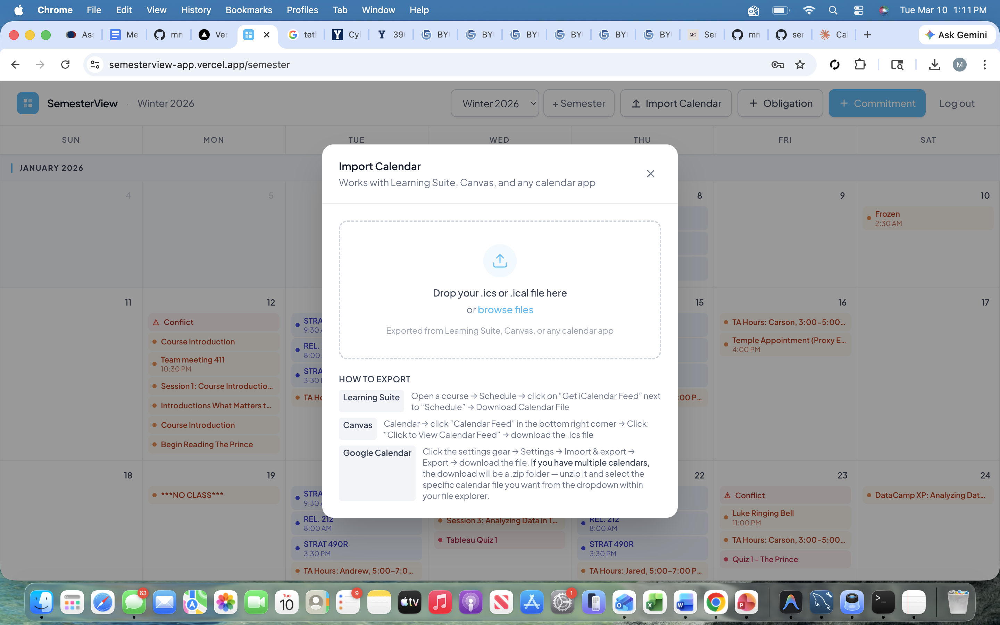
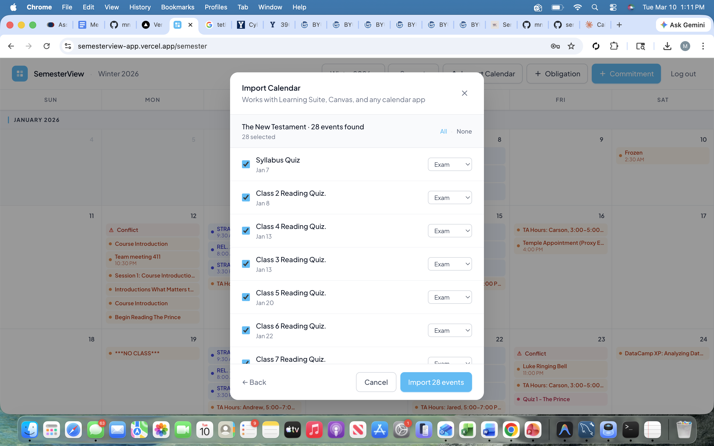
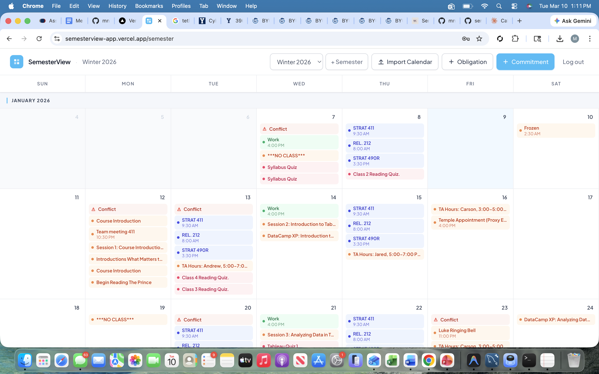

## Overview

A semester-long calendar tool for college students that surfaces scheduling conflicts before they happen. Unlike week-by-week planners, SemesterView shows the entire semester at once — layering recurring commitments (classes, work shifts, meetings) on top of variable obligations (exams, deadlines, events) so students can spot collisions early and protect time for what matters.

Key features include:

- Full-semester view from first day of classes through last final
- Create recurring commitments with days of week, start/end time, and date range
- Create variable obligations (exams, deadlines, personal and family events)
- Automatic conflict detection — flags days with 3+ high-priority events or exact time overlaps
- Import calendar events directly from Canvas, Learning Suite, or Google Calendar (.ics and .ical formats supported)
- Multiple semesters with quick switching
- Real-time updates when events are added, edited, or deleted
- User authentication with 30-day session persistence
- Mobile-responsive design (320px minimum width)

## Live Product Demo

  <!-- Open App button -->
  <a class="btn btn-primary d-inline-flex align-items-center"
     href="https://semesterview-app.vercel.app/login"
     target="_blank" rel="noopener"
     aria-label="Open live app">
    <i class="fa-solid fa-window-restore me-2" aria-hidden="true"></i>
    Open App in New Tab
  </a>

  <!-- Product Spec button -->
  <a class="btn btn-outline-secondary d-inline-flex align-items-center"
     href="semesterview-spec.html"
     aria-label="View product specification">
    <i class="fa-solid fa-file-lines me-2" aria-hidden="true"></i>
    Product Spec
  </a>

  <!-- GitHub Source button -->
  <a class="btn btn-outline-dark d-inline-flex align-items-center"
     href="https://github.com/mnielsen705/semesterview-app"
     target="_blank" rel="noopener"
     aria-label="Open GitHub source">
    <i class="fa-brands fa-github me-2" aria-hidden="true"></i>
    View source on GitHub
  </a>

<iframe src="https://semesterview-app.vercel.app/login"
        style="width:100%; height:900px; border:none;"
        allowfullscreen>
</iframe>

## Calendar Import in Action

::: {layout-ncol=3}

:::

## User Feedback

In three usability sessions testing calendar import on SemesterView, all testers successfully completed the core task — but none without friction. The primary pain point was navigating Canvas and Learning Suite to locate and export calendar files, not the app itself; one tester resorted to Googling how to find the Canvas .ics export, another couldn't locate the Learning Suite calendar import, and a third was critically blocked by not knowing how to unzip a file on Mac. Minor issues included an unintuitive click target in creating an "obligation" and a missing end-time field. Despite the friction, all three testers said they would use the product again (one conditionally, only if bulk import were available). The top priorities are: (1) add step-by-step import guides for Canvas and Learning Suite, (2) include Mac-specific file handling tips at the point of download, and (3) explore bulk import for Learning Suite or clearly set expectations around the class-by-class flow.

## Technical Details

**Framework/Stack:** Next.js 16, TypeScript

**UI Components:** shadcn/ui, Tailwind CSS v4

**Backend:** Supabase (PostgreSQL + Auth)

**Deployment:** Vercel

**Tools Used:**

- Claude Code for development assistance
- react-hook-form + Zod for form validation
- Custom iCal parser for calendar imports
- Supabase SSR for cookie-based authentication
